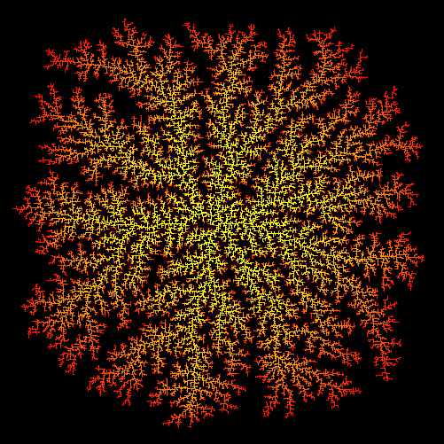

What is *dla*?
--------------

*dla* is a program that generates figures resulting from [diffusion-limited aggregation](https://en.wikipedia.org/wiki/Diffusion-limited_aggregation). It is a command-line tool written in Rust.

An example of output is provided below.

How to install *dla*?
---------------------

1. Clone the repository.
2. Compile the program (requires the Rust toolchain).
3. The executable is ready to run without further configuration.

How to use *dla*?
-----------------

*dla* provides a command-line interface.

`dla <output_filename> <image_size> <number_of_particles> <color_mode>`

* `<output_filename>`: path to the output file;
* `<image_size>`: width of the image in pixels (the image is square);
* `<number_of_particles>`: number of particles in the generated figure;
* (optional) `<color_mode>`: 0 for black and white (default), 1 for gradient.

The example above was generated with:

`dla output.png 501 50000 1`
